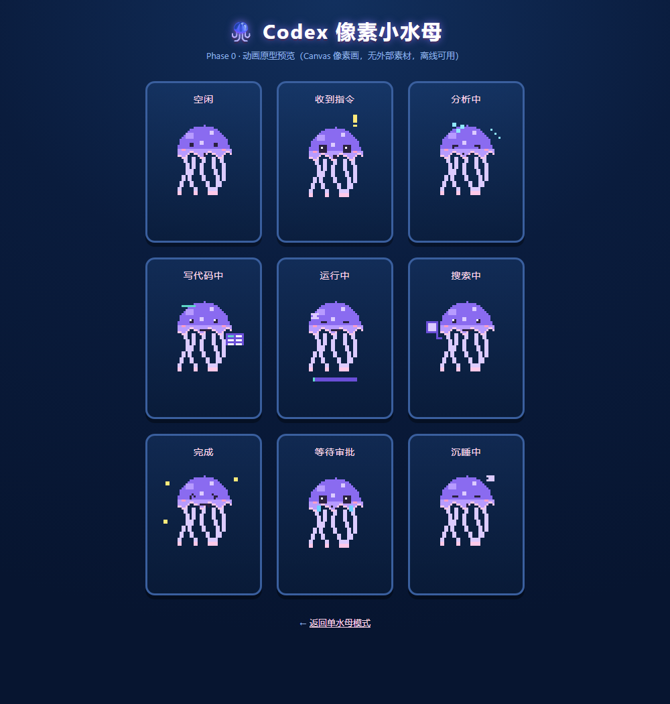

<p align="center">
  <a href="README.md"><b>English</b></a> · <a href="README.zh-CN.md">简体中文</a>
</p>

# 🪼 Agent Pet — a pixel jellyfish desktop pet for Codex / OpenCode / Claude Code / DeepSeek Harness

A pixel-art jellyfish floating in the corner of your desktop that **reflects the real-time working state of Codex, OpenCode, Claude Code, and DeepSeek Harness (DSH)**.
All four CLIs can run simultaneously — it shows whoever is working (LRU last-active-wins, see [Multi-CLI Linkage](#multi-cli-linkage-lru-last-active-wins) below).

<p align="center">
  
</p>

> 🐾 **Customizable appearance**: the project's development prompt ([PROMPT.md](PROMPT.md)) asks which pixel-art character you want *before* it starts building (jellyfish / cat / dog / fox / ghost / robot / dinosaur / mushroom …, jellyfish by default), so you can always have an AI rebuild it into your favorite character.

## Run

```bash
git clone https://github.com/YanCiQiLi-dot/agent-pet.git
cd agent-pet
npm install        # first run only (downloads Electron)
npm start          # launch the pet
```

> 💡 **Follows the CLI by default** (`config.json` → `startHidden: true`): the pet waits in the tray on launch and only appears when a Codex / OpenCode / Claude Code process is detected; it hides 5 seconds after they all exit. Set `startHidden` to `false` to always show on launch.

### Optional: desktop shortcut & auto-start (Windows)

To launch with one click (same as `npm start`), run this from the project root to create a desktop shortcut:

```powershell
$proj    = (Resolve-Path .).Path   # current project directory
$desktop = [Environment]::GetFolderPath('Desktop')   # auto-resolves the real desktop (handles OneDrive redirection)
$lnk  = Join-Path $desktop 'Codex桌宠.lnk'
$ws   = New-Object -ComObject WScript.Shell
$s    = $ws.CreateShortcut($lnk)
$s.TargetPath       = Join-Path $proj 'node_modules\electron\dist\electron.exe'
$s.Arguments        = '"' + $proj + '"'
$s.WorkingDirectory = $proj
$s.Save()
```

To auto-start on login, copy the same shortcut into the Startup folder: press <kbd>Win</kbd>+<kbd>R</kbd>, enter `shell:startup`, and drop a copy of the shortcut there. With `startHidden: true` it stays quietly in the tray at login.

## Interaction

- **Drag**: hold the jellyfish to move it anywhere (position is remembered)
- **Single click**: poke it to make it bubble
- **Double click**: open the **standalone panel** (next to the pet; draggable / resizable, tabs for recent activity / reminders)
- **Right click**: manually switch state / back to auto-linkage / reload / quit
- **Right click ⏰ Reminder**: 💧 drink water / 🚶 take a walk quick reminders, custom text, 5/15/30/60 min, manage, clear all
- **Right click 🎨 Theme**: blue-purple (default) / sakura pink / ocean blue one-click switch (persisted to `config.json`)
- **Tray**: resident tray icon; double-click to show/hide, right-click for manual state / reminders / quit
- **Transparent areas don't block the mouse**: the pet only captures the mouse on the canvas / panel; surrounding transparent areas (especially below) click through to the window underneath

## Status Details & Reminders

### 🕒 Live detail

Below the status label, the pet shows in real time "what it's doing" (no popup, no interruption):

| State | Example detail |
|---|---|
| 💻 Coding | `📝 editing: main.js, config.json … (3 files)` |
| ⏳ Running | `running: npm test` |
| 🔍 Searching | `searching: Codex API docs` |
| ⚠️ Awaiting approval | `needs your approval: allow downloading dependencies…` |
| 🤖 Analyzing | `coordinating sub-agents…` |

### 🕒 Recent activity timeline

Double-click the jellyfish to open the panel and see the last **10** tool activities (file edits / commands / searches / approvals / sub-agents), newest first.

### ⏰ To-do reminders

- **Add**: right click → `⏰ Reminder` (5/15/30/60 min / custom); or double-click and add quickly at the bottom of the panel
- **When due**: bounce + bubble + sound + system notification (disable via `notify` in `config.json`)
- **Persistent**: stored in `%APPDATA%\codex-pet\reminders.json`, survives restart
- **Manage**: delete individually in the panel; clear all via the right-click menu

### 🚶 Break reminder

`breakReminderMin` (default `45` min) reminds you to get up and move; set to `0` to disable.
`breakReminderText` customizes the message (default `🚶 起来活动一下，喝口水吧～`).

## Customize the Appearance

The current character is the pixel jellyfish (default). To switch to another pixel character:

- **Minimal change**: rewrite the draw function in `renderer/jellyfish.js` (keep the `Jellyfish.draw(ctx, state, t)` interface — `pet.js`, the state animations, and the menu all stay untouched)
- **Regenerate**: hand [PROMPT.md](PROMPT.md) to any AI; it will first ask which character you want, then build it (pixel style: programmatic canvas pixel art + `image-rendering: pixelated`)

## State Linkage

Log sources — Codex: `~/.codex/sessions/**/rollout-*.jsonl`; OpenCode: `opencode.log` + `prompt-history.jsonl`; Claude Code: `~/.claude/projects/**/*.jsonl`; DSH: `~/.dsh/sessions/**/session.jsonl.zstd`.

| State | Codex signal (`rollout-*.jsonl`) | OpenCode signal (`opencode.log` + `prompt-history.jsonl`) | Claude Code signal (session `.jsonl`) | DeepSeek Harness signal (`session.jsonl.zstd`) |
|---|---|---|---|---|
| 🛋️ Idle | no events for 60s | no events for 60s | no events for 60s | no events for 60s |
| 👂 Received | `user_message` event | new input in `prompt-history.jsonl` | `user` text line (`origin.kind=human`) | `user/message`, `agent/inbox/spliced` |
| 🧠 Analyzing | `task_started` / `reasoning` / `agent_message` / tool-result processing | `message=stream` / `permission=read/task/todowrite/skill` | `assistant` `thinking`/`text` blocks, `tool_result`, `Agent` tool, `turn_duration` with `pendingBackgroundAgentCount` | `turn/start`, `reasoning-chunks`, `text-chunks`, `tool-call-chunks`, `subagent`/`workflow` tools |
| 💻 Coding | `custom_tool_call: apply_patch` | `permission=edit` / `touching file` | `tool_use`: Edit / Write / MultiEdit / NotebookEdit | `tool/call`: write / edit / patch (with filename) |
| ⏳ Running | `function_call: shell_command` | `permission=bash` (with command detail) | `tool_use`: Bash / PowerShell (with command detail) | `tool/call`: pwsh (with command detail) |
| 🔍 Searching | `search` / `open_page` / `find_in_page` | `permission=websearch/webfetch/grep/glob` | `tool_use`: Read / Grep / Glob / WebSearch / WebFetch | `tool/call`: web_search / glob / grep / read |
| ✅ Done | `task_complete` (falls back to idle after 8s) | `exiting loop` (8s) | `turn_duration` with previous `assistant` line `stop_reason=end_turn` (8s) | `turn/end` (`reason.kind=completed`, 8s) |
| ⚠️ Awaiting approval | tool call with `require_escalated` / `justification` | `message=asking` (`per_`=approve / `que_`=answer) | `AskUserQuestion` tool (direct); or an authorization-required tool with no result within `approvalAfterMs` (default 20s) | `tool/call`: ask_user_question (direct); or `tool/result` containing the DSH sandbox denial format `[sandbox: …denied…]` |
| 💤 Sleeping | no events for 15 min | no events for 15 min | no events for 15 min | no events for 15 min |

> ⚠️ **Claude Code approval limitation**: its logs have no approval signal (while waiting for approval the log stops, indistinguishable from a long command), so we use a timeout heuristic — after an authorization-required tool (Bash/Edit/…) is invoked with no result within `approvalAfterMs`, it's judged as "awaiting approval". An already-approved long command is likewise silent and may be misread as "awaiting approval"; it recovers automatically once the tool result returns. Set `approvalAfterMs: 0` to disable the heuristic.

> 💡 **DSH log format**: session logs are zstd-compressed JSONL (each appended batch is an independent frame with a checksum, write batch window ≤200ms), incrementally decompressed by `dsh-watcher.js` using pure-JS `fzstd`; state derivation follows the same architecture as the other sources. `npm run dsh-replay -- <session.jsonl.zstd>` replays for verification.

> State details carry a source badge: 🅒 = Codex, 🅞 = OpenCode, 🄲 = Claude Code, 🅓 = DeepSeek Harness.

## Multi-CLI Linkage (LRU last-active-wins)

When `config.json` has `activeSource: "auto"`, the four CLIs running simultaneously are resolved by **last-active-wins**:

1. Whichever source last had a real work event (analyzing / coding / running / searching / approval / done) is the one the jellyfish shows
2. Idle / sleeping sources **do not preempt** others; if the current source goes idle while another is working, it auto-switches
3. The detail line is prefixed with the source badge (🅒 Codex / 🅞 OpenCode / 🄲 Claude Code / 🅓 DeepSeek Harness); the timeline likewise comes from the current active source
4. You can also pin a single source: `activeSource: "codex"` / `"opencode"` / `"claude"` / `"dsh"`

The logic lives in `source-router.js` (pure Node, `npm run router-test` self-test).

> 💡 **DSH "is-it-working" detection**: DSH runs as a node process (its process name isn't unique), so the pet uses **log freshness** instead — if any `session.jsonl.zstd` has been updated in the last 60s, DSH is considered active (pet shows); it hides 5s after the logs stop (`hideDelayMs`), integrating seamlessly with the process-detection `startHidden` / `followMode` logic.

## Debug Tools

```bash
npm run watch      # live view of state-machine derivation in the terminal (no pet needed)
npm run replay -- <rollout file>   # replay historical logs to verify state derivation
npm run opencode-watch   # live view of OpenCode state derivation (no pet needed)
npm run opencode-replay -- <opencode.log>  # replay OpenCode logs to verify state derivation
npm run claude-watch     # live view of Claude Code state derivation (no pet needed)
npm run claude-replay -- <session.jsonl>  # replay a Claude Code session log to verify state derivation
npm run claude-test      # Claude Code state-machine self-test
npm run dsh-watch        # live view of DeepSeek Harness state derivation (no pet needed)
npm run dsh-replay -- <session.jsonl.zstd>  # replay a DSH session log to verify state derivation
npm run dsh-test         # DeepSeek Harness state-machine self-test
npm run router-test      # multi-source LRU switching logic self-test
npm run state-test       # Codex state-machine self-test (node state-watcher.js --test)
npm run opencode-test    # OpenCode state-machine self-test (node opencode-watcher.js --test)
npm run preview          # open the animation prototype in the browser (gallery mode ?gallery=1)
npm run remind-test      # reminder module self-test (node reminders.js --test)
```

> 🔄 **Config hot-reload**: editing `config.json` takes effect ~0.3s later without restarting the pet (skin / sound / status label / scale / detected process names / poll interval / break reminder, etc.). Pet logs auto-rotate at 2MB keeping a `.1` backup.

## Config (`config.json`)

| Key | Description | Current value |
|---|---|---|
| `followMode` | `hide`: hide the window when Codex exits (tray stays); `quit`: quit with Codex | `hide` |
| `startHidden` | `true`: hidden on launch, show when Codex is detected; `false`: show on launch | `true` |
| `detectNames` | process names to detect (any present → show the pet) | `["codex", "Codex", "opencode", "claude"]` |
| `activeSource` | `auto`: last-active-wins across the four CLIs; `codex` / `opencode` / `claude` / `dsh`: pin to one source | `auto` |
| `pollMs` / `debounceTicks` | process-detection poll interval / debounce ticks | `2000` / `2` |
| `hideDelayMs` | delay (ms) before hiding after Codex exits | `5000` |
| `scale` | pet size multiplier | `1.0` |
| `theme` | skin (default/sakura/ocean…) | `default` |
| `sound` / `showStatusLabel` | sound / status-label toggles | `true` |
| `notify` | whether reminders send system notifications | `true` |
| `breakReminderMin` | break-reminder interval (min), `0` disables | `45` |
| `breakReminderText` | break-reminder text (customizable) | `🚶 起来活动一下，喝口水吧～` |
| `approvalAfterMs` | Claude Code approval-heuristic timeout (ms), `0` disables | `20000` |

## Directory

```
codex-pet/
├─ package.json       # startup scripts / dependencies (electron)
├─ PROMPT.md          # reproducible development prompt (includes "ask for character first")
├─ config.json        # linkage mode / detected names / sound / skin / startHidden
├─ main.js            # Electron main process (transparent always-on-top window, menu, position memory, start/stop linkage)
├─ preload.js         # secure bridge
├─ state-watcher.js   # Codex log listener + state machine (pure Node, independently testable)
├─ opencode-watcher.js# OpenCode log listener + state machine (pure Node, independently testable)
├─ claude-watcher.js  # Claude Code session-log listener + state machine (pure Node, independently testable)
├─ dsh-watcher.js     # DeepSeek Harness session-log listener + state machine (zstd decode, pure Node, independently testable)
├─ source-router.js   # multi-source LRU router (shows whoever is working, --test self-test)
├─ codex-watcher.js   # process lifecycle detection (pure Node, --probe simulation)
├─ reminders.js       # reminder manager (pure Node, --test self-test; to-do + break)
├─ launcher.js        # optional daemon (for followMode=quit)
├─ assets/tray.png    # tray icon
├─ assets/gallery.png  # all-nine-states gallery (README hero image)
└─ renderer/
   ├─ index.html      # pet window page (?gallery=1 gallery debug)
   ├─ style.css
   ├─ jellyfish.js    # pixel-jellyfish renderer (swappable for any pixel character)
   └─ pet.js          # render-layer logic
```

## Roadmap

- ✅ Phase 0: pixel jellyfish + state animations
- ✅ Phase 1: Electron transparent always-on-top window + real log linkage + drag/menu
- ✅ Phase 2: sound, tray icon, auto-start (Startup folder .lnk), multiple skins
- ✅ Phase 3 (2026-08-05): startHidden — wait in tray on boot, appear only when Codex runs; CLI version linked too
- ✅ Phase 4 (2026-08-08): status extension — live detail (what it's running / editing) + recent-activity timeline + detail panel
- ✅ Phase 4 (2026-08-08): reminders — to-do reminders (persistent / system notification / bounce animation) + break reminder
- ✅ Phase 5 (2026-08-09): OpenCode support — added `opencode-watcher.js` parallel listener + `source-router.js` LRU two-source switching (🅒/🅞 badges)
- ✅ Phase 6 (2026-08-13): Claude Code support — added `claude-watcher.js` parallel listener (`~/.claude/projects` session logs) + router generalized to three-source LRU (🄲 badge) + approval timeout heuristic
- ✅ Phase 7 (2026-08-14): DeepSeek Harness support — added `dsh-watcher.js` parallel listener (`~/.dsh/sessions` zstd-compressed session logs, `fzstd` pure-JS decode) + router generalized to four-source LRU (🅓 badge) + log-freshness presence detection (node process name isn't unique, so no process detection)
